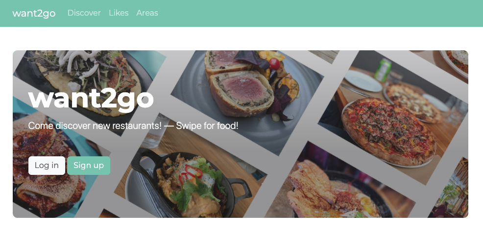
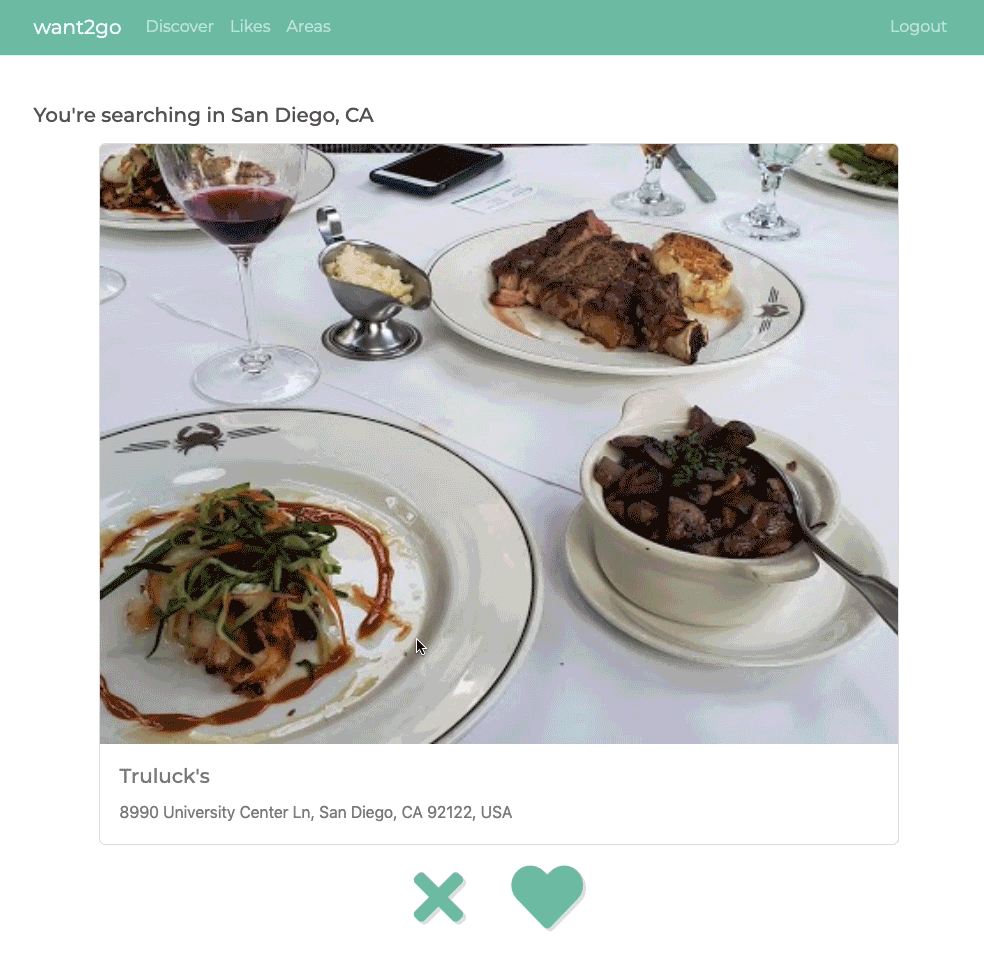
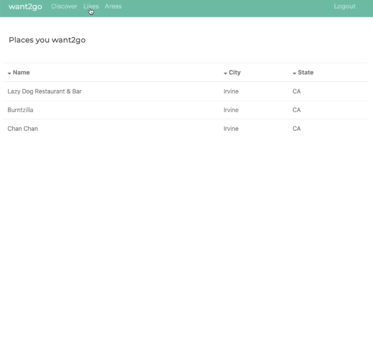

# want2go

## Details
The goal of Want2Go is to provide a more intuitive and 'computationally kind' way discovering new places to eat. I think that other people's reviews of restaurants may inhibit one's decision of wanting to go to a given place. I think that food is very subjective, and I wanted to make an app that had no stars and reviews. Want2Go helps you keep track of restaurants that you want to go in other cities. Want2Go is a restaurant discovery app and it helps you keep track of the places you want to go. [Heroku Link](https://want2go.herokuapp.com/)

## Features:
* Restaurant discovery: Like and Dislike
* Discovery areas
* List of liked restaurants

## API:
I used the [Google Places API](https://developers.google.com/places/web-service/overview). The Places API provided an easy way to search in an area, retrieve location details, and photos.

## Using the App
When first using the app, a user will be asked to enter in an area to search in. A user will be able to add new search areas by clicking the `Areas` button in the navbar. After an area is entered, the user will be redirected to discover new restaurants. Liked restaurants will be found by clicking the `Likes` button in the navbar.

### Discovery

### Liked Restaurants

## Future goals:
* additional toggle switches for users to specify restaurant search: corporate/non corporate
* Like / Dislike animations
* Delete account

## Technology Stack:
* Python
* PostgreSQL
* Javascript 

